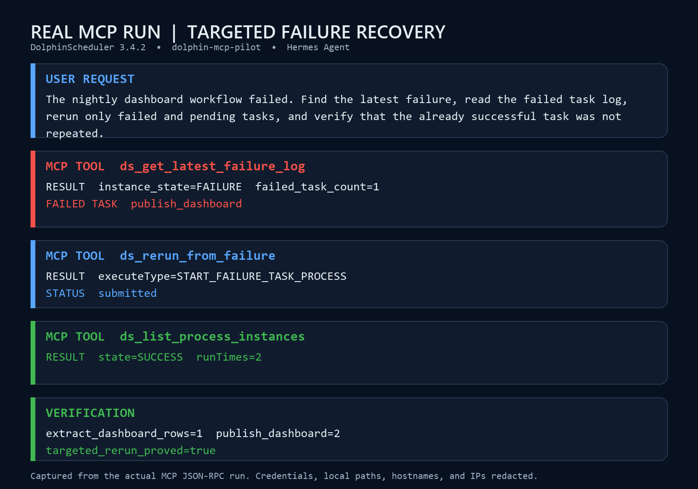

# 用 MCP 精确恢复失败的 DolphinScheduler 工作流

**真实环境：DolphinScheduler 3.4.2 + dolphin-mcp-pilot + Hermes Agent**  
**运行日期：2026-08-14**

> 本文记录一次真实 MCP JSON-RPC 运维实验：代理定位唯一失败任务，读取日志，从失败节点重跑，并用双重计数证明成功的上游任务没有重复执行。凭据、本地路径、主机名和内网 IP 均已脱敏。



## 问题

两阶段看板流水线包含：

1. `extract_dashboard_rows`：生成 42 行看板数据；
2. `publish_dashboard`：发布看板。

发布阶段第一次执行时模拟临时闸门故障并返回退出码 `42`，第二次执行成功。给代理的请求是：

> The nightly dashboard workflow failed. Find the latest failure, read the failed task log, rerun only failed and pending tasks, and verify that the already successful task was not repeated.

关键要求不是“重新跑一次”，而是证明只恢复失败部分。

## 实际 MCP 操作

```text
ds_create_project
ds_create_workflow
ds_run_workflow
ds_list_process_instances
ds_list_task_instances
ds_get_latest_failure_log
ds_rerun_from_failure
ds_list_process_instances
```

诊断结果：

```text
instance_state=FAILURE
failed_task_count=1
failed_task=publish_dashboard
```

恢复操作：

```text
executeType=START_FAILURE_TASK_PROCESS
status=submitted
```

最终结果：

```text
state=SUCCESS
runTimes=2
extract_dashboard_rows=1
publish_dashboard=2
targeted_rerun_proved=true
```

## 为什么可以证明“只重跑失败节点”

仅看工作流最终变绿并不充分，所以每个任务都写入独立执行计数：

| 任务 | 首次执行 | 恢复后累计 | 解释 |
|---|---:|---:|---|
| `extract_dashboard_rows` | 1 | **1** | 已成功任务未重复 |
| `publish_dashboard` | 1（失败） | **2** | 失败任务单独再执行一次 |

同时，DolphinScheduler 任务实例也显示：

- 原上游任务实例保持成功；
- 发布任务产生新的成功实例；
- 工作流实例 `runTimes=2`；
- 最终状态为 `SUCCESS`。

## 实际接入时发现的两个兼容问题

### 1. DolphinScheduler 3.4 的 REST 术语变化

3.4 将多组 `process` 路径和字段改为 `workflow`：

```text
process-definition        -> workflow-definition
process-instances         -> workflow-instances
processDefinitionCode     -> workflowDefinitionCode
processInstanceId         -> workflowInstanceId
```

兼容策略是保留旧请求为首选，只在旧地址返回 `400/404/405`，或响应明确提示缺少 3.4 新字段时，进行一次受限转换重试。这样可以兼容旧版而不盲目重复有副作用的请求。

### 2. 显式 DAG 的虚拟根边

当调用者只提供：

```text
extract_dashboard_rows -> publish_dashboard
```

原实现没有补 DolphinScheduler 需要的起始关系：

```text
0 -> extract_dashboard_rows
```

结果是起始任务未进入顶点集合，服务端返回误导性的 `workflow node has cycle`。修复后，所有无入边任务会自动添加虚拟根边。

## Windows 独立运行补充

本次验证在 Windows 上运行 DolphinScheduler 3.4.2 standalone：

- 使用官方 `cmd` shell interceptor；
- 官方 3.4.2 bootstrap 生成 `cmd.exe <task.bat>`，会在批处理结束后继续等待；
- 验证环境通过仅运行时前置 JAR改为 `cmd.exe /d /c <task.bat>`；
- 该运行时补丁不属于 dolphin-mcp-pilot 产品提交。

Linux 或容器部署不需要这条 Windows 说明。

## 回归测试

新增测试覆盖：

- 3.4 路径和字段转换；
- 旧地址 HTTP 失败后的单次重试；
- JSON 缺少 `workflowInstanceId` 时的受限重试；
- 3.4 响应字段向旧字段添加只读别名；
- 显式依赖图自动补虚拟根边。

执行结果：

```text
27 passed, 1 warning in 0.48s
```

## 结论

`ds_get_latest_failure_log → ds_rerun_from_failure` 可以把常见故障恢复压缩为两个 MCP 操作，但真正可靠的自动运维还必须验证：

1. 失败任务是谁；
2. 恢复命令是否被接受；
3. 工作流最终是否成功；
4. 已成功任务是否未重复执行。

本案例用任务实例和独立计数同时证明了这四点。

---

- 案例作者：BBOSIK
- 运行主机：Hermes Agent（MCP host 类型 `other`）
- 原始凭据和未脱敏日志：未公开
